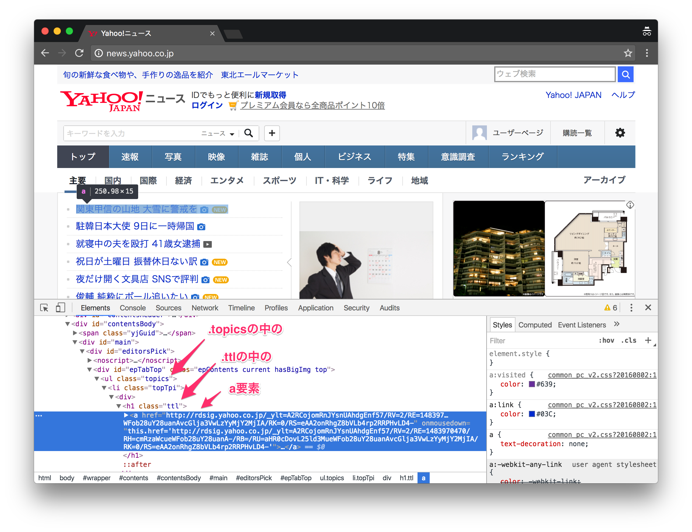

# Pythonクローリング&スクレイピング ハンズオン

このハンズオンでは、Yahoo!ニュースのトップニュースを題材として、Pythonによるスクレイピングを学びます。

サードパーティライブラリのRequestsとBeautiful Soupを使います。

## 0. 動作環境

* macOS/Linux/Windows
* Python 3.4以降

## 1. 仮想環境の作成

`scraping`という名前の仮想環境を作成し、仮想環境を有効化します。※わかる方は仮想環境を作成せずに進めても構いません。

### macOS/Linux

```
$ python3 -m venv scraping
$ . scraping/bin/activate
```

### Windows

```
> python -m venv scraping
> scraping\bin\activate
```

## 2. サードパーティライブラリのインストール

* [Requests](http://docs.python-requests.org/en/master/): Webページを取得する
* [Beautiful Soup](https://www.crummy.com/software/BeautifulSoup/bs4/doc/): Webページからスクレイピングする
* [Chardet](https://github.com/chardet/chardet): エンコーディングを自動判別する

```
(scraping) $ pip install requests beautifulsoup4 chardet
```

## 3. インタラクティブシェルの起動

※わかる方はIPythonやJupyter Notebookでも構いません。

```
(scraping) $ python
```

## 4. スクレイピングの実施

インタラクティブシェルを使って、[Yahoo!ニュース](http://news.yahoo.co.jp/)のトップニュース一覧を取得します。

※RSSを使えばもっと簡単ですが、これは練習ですので。

```python
# requestsモジュールをインポート
>>> import requests
# Yahoo!ニュースのトップページをGETで取得
>>> r = requests.get('http://news.yahoo.co.jp/')
# ステータスコードを確認
>>> r.status_code
200
# エンコーディングを確認
>>> r.encoding
'UTF-8'
# レスポンスボディ（bytes型）を確認
>>> r.content
b'<!DOCTYPE html>\n<html lang="ja"\n    xmlns:og="http://ogp.me/ns#"\n    xmlns:fb="http://ogp.me/ns/fb#">\n<head>\n<meta http-equiv="Content-Type" content="text/html; charset=utf-8">...

# bs4モジュールからBeautifulSoupクラスをインポート
>>> from bs4 import BeautifulSoup
# BeautifulSoupオブジェクトを作成
# 第1引数はパースするHTML、第2引数は使用するパーサー
>>> soup = BeautifulSoup(r.content, 'html.parser')
# title属性でtitle要素を表すTagオブジェクトを取得
>>> soup.title
<title>Yahoo!ニュース</title>
# Tagオブジェクトのstring属性で直下の文字列を取得
>>> soup.title.string
'Yahoo!ニュース'
# select()でCSSセレクターにマッチする要素のリストを取得
>>> soup.select('.topics .ttl a')
[<a href="http://news.yahoo.co.jp/pickup/6226622" onmousedown="this.href='http://news.yahoo.co.jp/pickup/6226622'">関東甲信の山地 大雪に警戒を<span class="icPhoto">写真</span><span class="icNew">new</span></a>, <a href="http://news.yahoo.co.jp/pickup/6226616" onmousedown="this.href='http://news.yahoo.co.jp/pickup/6226616'">駐韓日本大使 9日に一時帰国<span class="icPhoto">写真</span></a>, <a href="http://news.yahoo.co.jp/pickup/6226615" onmousedown="this.href='http://news.yahoo.co.jp/pickup/6226615'">就寝中の夫を殴打 41歳女逮捕<span class="icVideo">映像</span></a>, <a href="http://news.yahoo.co.jp/pickup/6226624" onmousedown="this.href='http://news.yahoo.co.jp/pickup/6226624'">祝日が土曜日 振替休日ない訳<span class="icPhoto">写真</span><span class="icNew">new</span></a>, <a href="http://news.yahoo.co.jp/pickup/6226607" onmousedown="this.href='http://news.yahoo.co.jp/pickup/6226607'">夜だけ開く文具店 SNSで評判<span class="icPhoto">写真</span><span class="icNew">new</span></a>, <a href="http://news.yahoo.co.jp/pickup/6226623" onmousedown="this.href='http://news.yahoo.co.jp/pickup/6226623'">俊輔 純粋にボール追いたい<span class="icPhoto">写真</span><span class="icNew">new</span></a>, <a href="http://news.yahoo.co.jp/pickup/6226619" onmousedown="this.href='http://news.yahoo.co.jp/pickup/6226619'">錦織が惜敗 初優勝ならず<span class="icPhoto">写真</span></a>, <a href="http://news.yahoo.co.jp/pickup/6226617" onmousedown="this.href='http://news.yahoo.co.jp/pickup/6226617'">爆問田中が喜び会見 太田暴走<span class="icPhoto">写真</span></a>]
# ニュースのURL（a要素のhref属性）とタイトル（a要素内の文字列の内最初のもの）を表示
>>> for a in soup.select('.topics .ttl a'):
...     print(a['href'], list(a.strings)[0])
...
http://news.yahoo.co.jp/pickup/6226622 関東甲信の山地 大雪に警戒を
http://news.yahoo.co.jp/pickup/6226616 駐韓日本大使 9日に一時帰国
http://news.yahoo.co.jp/pickup/6226615 就寝中の夫を殴打 41歳女逮捕
http://news.yahoo.co.jp/pickup/6226624 祝日が土曜日 振替休日ない訳
http://news.yahoo.co.jp/pickup/6226607 夜だけ開く文具店 SNSで評判
http://news.yahoo.co.jp/pickup/6226623 俊輔 純粋にボール追いたい
http://news.yahoo.co.jp/pickup/6226619 錦織が惜敗 初優勝ならず
http://news.yahoo.co.jp/pickup/6226617 爆問田中が喜び会見 太田暴走
```

CSSセレクターを考える際はブラウザーの開発者ツールを活用します。Google Chromeの場合、要素を右クリックして「検証」を選択するとその要素にフォーカスした状態で開発者ツールが表示されます。



## 参考

* [Requests: HTTP for Humans — Requests 2.12.4 documentation](http://docs.python-requests.org/en/master/)
* [Beautiful Soup Documentation — Beautiful Soup 4.4.0 documentation](https://www.crummy.com/software/BeautifulSoup/bs4/doc/)

## 次のステップ

[exercises.md](./exercises.md)に練習問題を用意しています。

回答例は[answer](./answer)ディレクトリ内にあります。
